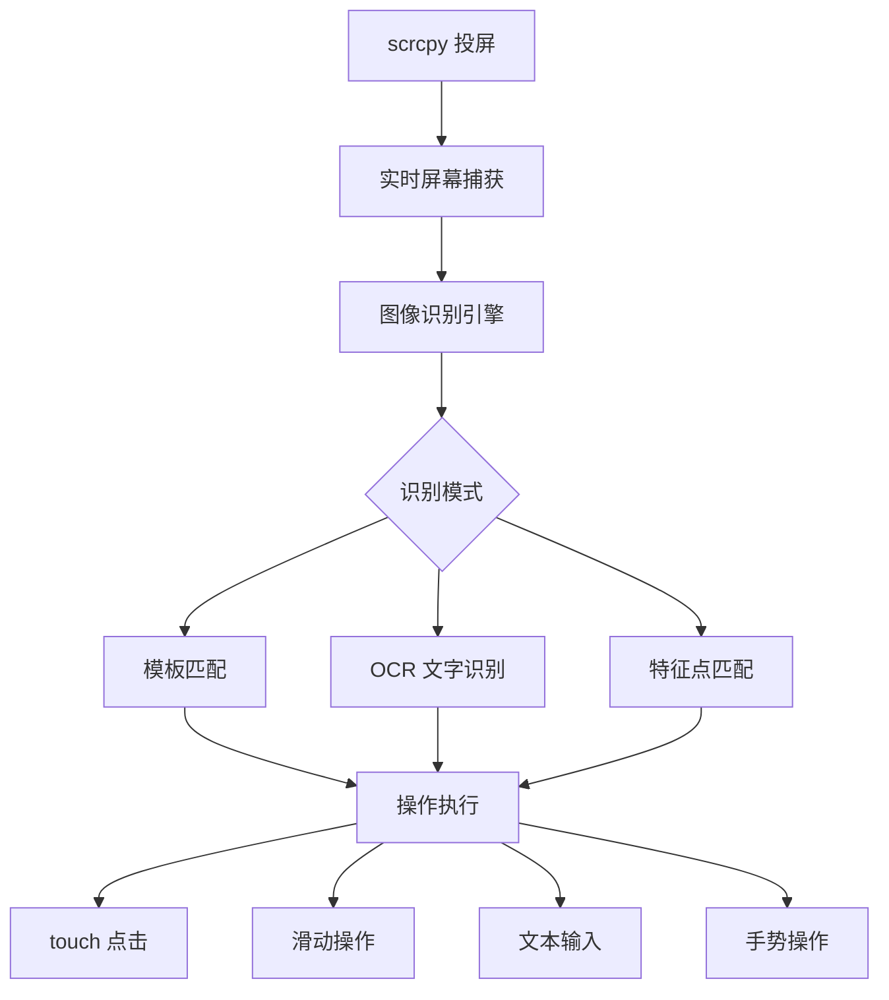
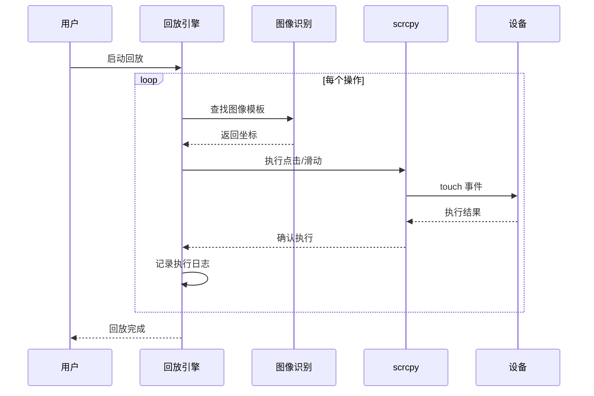
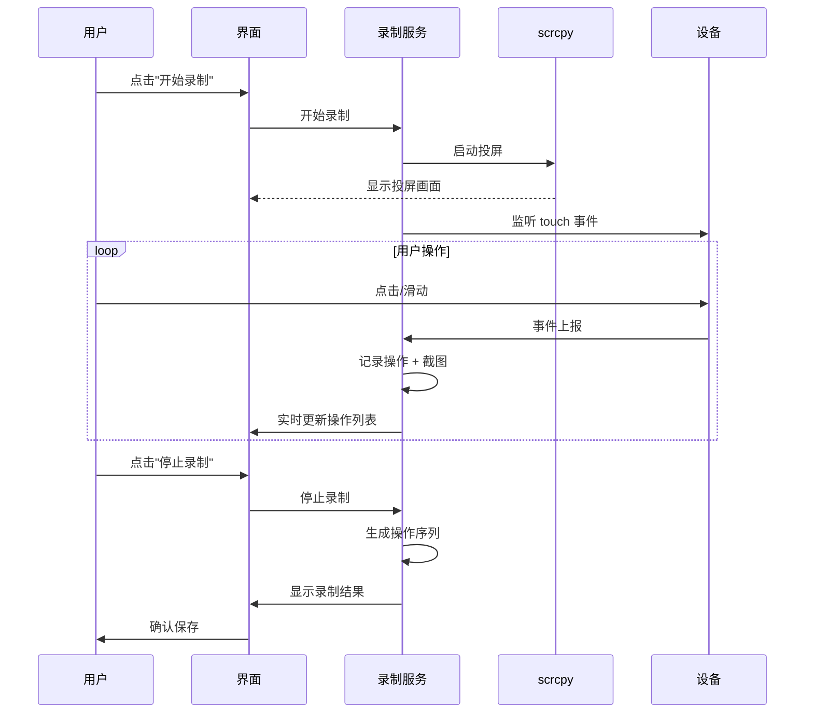
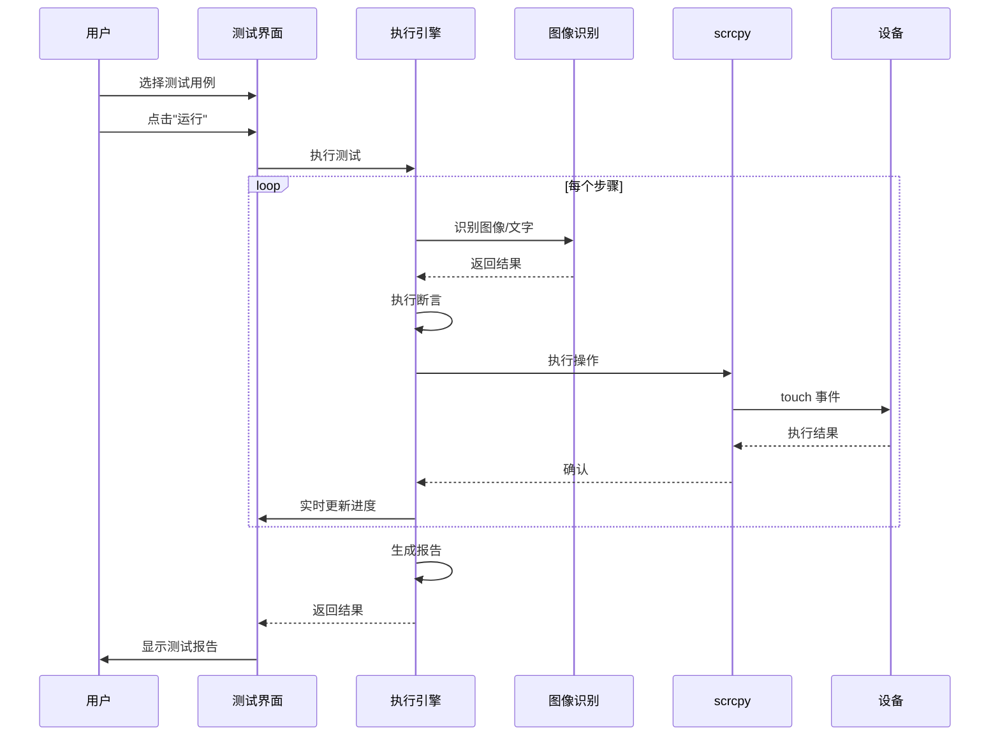

# APP 自动化操作与游戏测试系统设计方案

## 1. 系统概述

### 1.1 方案目标

设计一套结合**图像识别**和**scrcpy 投屏**的自动化系统，实现：
- 🎮 自定义操作 APP（录制/回放用户操作）
- 🧪 自动测试游戏 APP（基于图像识别的自动化测试）
- 🤖 可视化操作编排（拖拽式流程设计）

### 1.2 核心能力



---

## 2. 系统架构

### 2.1 整体架构图

```
┌─────────────────────────────────────────────────────────────┐
│                     用户界面层 (Vue 3)                        │
│  ┌─────────────┐  ┌─────────────┐  ┌─────────────────────┐  │
│  │ 设备管理器   │  │ 操作编排器   │  │ 测试用例编辑器       │  │
│  └─────────────┘  └─────────────┘  └─────────────────────┘  │
│  ┌─────────────┐  ┌─────────────┐  ┌─────────────────────┐  │
│  │ 录制回放    │  │ 图像识别器   │  │ 测试报告查看器       │  │
│  └─────────────┘  └─────────────┘  └─────────────────────┘  │
└─────────────────────────────────────────────────────────────┘
                              ↕ IPC
┌─────────────────────────────────────────────────────────────┐
│                   业务逻辑层 (TypeScript)                    │
│  ┌─────────────┐  ┌─────────────┐  ┌─────────────────────┐  │
│  │ 设备管理服务 │  │ 流程引擎    │  │ 测试执行引擎         │  │
│  └─────────────┘  └─────────────┘  └─────────────────────┘  │
│  ┌─────────────┐  ┌─────────────┐  ┌─────────────────────┐  │
│  │ 录制服务    │  │ 识别服务    │  │ 报告生成服务         │  │
│  └─────────────┘  └─────────────┘  └─────────────────────┘  │
└─────────────────────────────────────────────────────────────┘
                              ↕
┌─────────────────────────────────────────────────────────────┐
│                   设备交互层 (Electron + scrcpy)              │
│  ┌─────────────┐  ┌─────────────┐  ┌─────────────────────┐  │
│  │ scrcpy 服务  │  │ ADB 服务     │  │ 图像识别服务         │  │
│  └─────────────┘  └─────────────┘  └─────────────────────┘  │
│  ┌─────────────┐  ┌─────────────┐  ┌─────────────────────┐  │
│  │ 投屏控制    │  │ touch 事件    │  │ 屏幕捕获            │  │
│  └─────────────┘  └─────────────┘  └─────────────────────┘  │
└─────────────────────────────────────────────────────────────┘
                              ↕
┌─────────────────────────────────────────────────────────────┐
│                   数据存储层 (SQLite)                         │
│  ┌─────────────┐  ┌─────────────┐  ┌─────────────────────┐  │
│  │ 设备配置    │  │ 操作模板库   │  │ 测试用例库           │  │
│  └─────────────┘  └─────────────┘  └─────────────────────┘  │
│  ┌─────────────┐  ┌─────────────┐  ┌─────────────────────┐  │
│  │ 测试记录    │  │ 图像特征库   │  │ 脚本库               │  │
│  └─────────────┘  └─────────────┘  └─────────────────────┘  │
└─────────────────────────────────────────────────────────────┘
```

### 2.2 核心模块说明

| 模块 | 职责 | 技术栈 |
|------|------|--------|
| **设备管理** | 连接/断开 Android 设备、管理多设备 | ADB + scrcpy |
| **投屏服务** | 实时投屏、屏幕捕获、低延迟传输 | scrcpy + WebSocket |
| **图像识别** | 模板匹配、OCR、特征识别 | OpenCV + Tesseract |
| **操作编排** | 可视化流程设计、节点编排 | Vue 3 + Vue Flow |
| **录制回放** | 记录操作、生成脚本、回放执行 | 事件拦截 + 脚本引擎 |
| **测试引擎** | 执行测试用例、断言验证、生成报告 | Vitest + 自定义 runner |

---

## 3. 功能设计

### 3.1 自定义操作 APP（录制/回放）

#### 3.1.1 录制模式

```
┌──────────────────────────────────────┐
│          录制界面                     │
│  ┌────────────────────────────────┐  │
│  │                                │  │
│  │      [ 手机投屏画面 ]            │  │
│  │                                │  │
│  │   ● REC [00:02:35]             │  │
│  │                                │  │
│  └────────────────────────────────┘  │
│                                      │
│  [开始] [暂停] [停止] [添加标记点]    │
└──────────────────────────────────────┘
```

**录制内容**：
1. **点击操作**：坐标 + 时间戳 + 触发区域截图
2. **滑动操作**：起点/终点坐标 + 轨迹 + 时长
3. **文本输入**：目标输入框 + 输入内容
4. **等待操作**：等待时长 + 触发条件
5. **图像标记**：手动框选识别区域

**数据结构**：
```typescript
interface RecordedAction {
    id: string;
    type: 'click' | 'swipe' | 'input' | 'wait' | 'image';
    timestamp: number;
    position?: { x: number; y: number };
    imageTemplate?: Buffer;      // 触发区域的截图
    ocrText?: string;            // OCR 识别的文字
    parameters?: {
        text?: string;           // 输入文本
        duration?: number;       // 滑动时长
        waitCondition?: string;  // 等待条件
    };
}
```

#### 3.1.2 回放模式



### 3.2 自动测试游戏 APP

#### 3.2.1 测试用例结构

```yaml
test_case:
  id: "game_login_test"
  name: "游戏登录流程测试"
  description: "测试从启动到进入游戏主界面的完整流程"
  
  preconditions:
    - app_installed: "com.example.game"
    - app_launched: true
    - network: "wifi"
  
  steps:
    - id: step1
      action: "wait_for_image"
      params:
        template: "login_button.png"
        timeout: 10000
      assertions:
        - found: true
    
    - id: step2
      action: "click"
      params:
        template: "login_button.png"
      assertions:
        - success: true
    
    - id: step3
      action: "wait_for_ocr"
      params:
        text: "欢迎来到游戏"
        timeout: 5000
      assertions:
        - found: true
    
    - id: step4
      action: "assert_image"
      params:
        template: "main_ui.png"
        threshold: 0.9
      assertions:
        - found: true
  
  postconditions:
    - cleanup: "close_app"
    - screenshot: "final_state.png"
```

#### 3.2.2 测试执行流程

```
┌─────────────┐
│ 测试开始     │
└──────┬──────┘
       ↓
┌─────────────┐
│ 前置检查     │ → 设备连接？→ 否 → 连接设备
└──────┬──────┘    ↓是
       ↓
┌─────────────┐
│ 启动 APP     │
└──────┬──────┘
       ↓
┌─────────────┐
│ 执行步骤 1   │ → 图像识别 → 执行操作 → 断言验证
└──────┬──────┘
       ↓
┌─────────────┐
│ 执行步骤 2   │ → ...
└──────┬──────┘
       ↓
       ...
       ↓
┌─────────────┐
│ 生成报告     │
└─────────────┘
```

#### 3.2.3 断言类型

| 断言类型 | 说明 | 示例 |
|---------|------|------|
| `image_exists` | 图像存在 | 按钮、图标出现 |
| `image_not_exists` | 图像不存在 | 弹窗已关闭 |
| `ocr_contains` | OCR 包含文字 | 显示"成功"文字 |
| `ocr_equals` | OCR 精确匹配 | 金币数=1000 |
| `element_clickable` | 元素可点击 | 按钮可交互 |
| `wait_complete` | 等待完成 | 加载动画消失 |

---

## 4. 核心功能详细设计

### 4.1 图像识别增强

#### 4.1.1 多层级识别策略

```
识别请求
    ↓
┌─────────────────────┐
│ Level 1: 模板匹配    │ → 快速匹配（<100ms）
│ - 精确模板匹配       │
│ - 多尺度匹配         │
└──────┬──────────────┘
       ↓ 未匹配
┌─────────────────────┐
│ Level 2: 特征匹配    │ → 鲁棒匹配（<500ms）
│ - ORB/SIFT 特征点    │
│ - 透视变换容错       │
└──────┬──────────────┘
       ↓ 未匹配
┌─────────────────────┐
│ Level 3: OCR 辅助    │ → 文字识别（<1s）
│ - 文字区域检测       │
│ - Tesseract 识别     │
└──────┬──────────────┘
       ↓ 未匹配
┌─────────────────────┐
│ Level 4: AI 识别     │ → 深度学习（>1s）
│ - YOLO 目标检测      │
│ - 自定义模型         │
└─────────────────────┘
```

#### 4.1.2 图像模板库管理

```
┌─────────────────────────────────────┐
│         图像模板库                    │
│                                     │
│  📁 game_login/                     │
│    ├── login_button.png             │
│    ├── login_button_mask.png        │
│    ├── login_button.json (元数据)    │
│    └── variants/                    │
│        ├── login_button_dark.png    │
│        └── login_button_highlight.png│
│                                     │
│  📁 game_main_ui/                   │
│    ├── attack_button.png            │
│    ├── skill_icon_1.png             │
│    └── ...                          │
└─────────────────────────────────────┘
```

**元数据示例**：
```json
{
  "name": "login_button",
  "category": "login",
  "tags": ["按钮", "登录", "主流程"],
  "threshold": 0.85,
  "scale_range": [0.9, 1.1],
  "rotation_tolerance": 5,
  "created_at": "2024-01-01T10:00:00Z",
  "usage_count": 156,
  "success_rate": 0.98
}
```

### 4.2 可视化操作编排器

#### 4.2.1 界面布局

```
┌─────────────────────────────────────────────────────────────┐
│  🎬 操作编排器                         [保存] [运行] [导出]   │
├─────────────────┬─────────────────────────────────┬─────────┤
│                 │                                 │         │
│  组件库         │         流程画布                 │ 属性面板 │
│  ┌───────────┐  │  ┌───────────────────────────┐  │         │
│  │ 🖱️ 点击    │  │  │  ┌─────┐                 │  │ 选中节点 │
│  │ 📱 滑动    │  │  │  │开始  │                 │  │ 详细配置 │
│  │ ⌨️ 输入    │  │  │  └──┬──┘                 │  │         │
│  │ ⏱️ 等待    │  │  │     ↓                    │  │ 模板：   │
│  │ 🔍 图像识别 │  │  │  ┌─────┐                 │  │ [选择]   │
│  │ 📝 OCR     │  │  │  │点击  │                 │  │         │
│  │ ✅ 断言    │  │  │  │登录按钮│                │  │ 坐标：   │
│  │ 🔄 循环    │  │  │  └──┬──┘                 │  │ X: 150   │
│  │ 🔀 条件    │  │  │     ↓                    │  │ Y: 300   │
│  │ 📊 变量    │  │  │  ┌─────┐                 │  │         │
│  └───────────┘  │  │  │结束  │                 │  │ 超时：   │
│                 │  │  │  └─────┘                 │  │ 5000ms  │
│  搜索组件...    │  │                           │  │         │
│                 │                                 │         │
└─────────────────┴─────────────────────────────────┴─────────┘
```

#### 4.2.2 节点类型

| 节点图标 | 节点类型 | 输入 | 输出 | 说明 |
|---------|---------|------|------|------|
| 🟢 | **开始节点** | - | flow | 流程起点 |
| 🔴 | **结束节点** | flow | - | 流程终点 |
| 🖱️ | **点击** | flow, image | flow, result | 点击操作 |
| 📱 | **滑动** | flow | flow | 滑动操作 |
| ⌨️ | **输入** | flow, text | flow | 文本输入 |
| ⏱️ | **等待** | flow, condition | flow | 等待条件 |
| 🔍 | **图像识别** | flow, template | flow, found, position | 查找图像 |
| 📝 | **OCR 识别** | flow, region | flow, text | 文字识别 |
| ✅ | **断言** | flow, condition | flow, pass/fail | 验证结果 |
| 🔄 | **循环** | flow, condition | flow | 循环执行 |
| 🔀 | **条件** | flow, condition | flow[true], flow[false] | 分支判断 |

### 4.3 scrcpy 集成方案

#### 4.3.1 scrcpy 服务模式

```typescript
interface ScrcpyService {
    // 启动投屏
    startMirror(deviceId: string, options: MirrorOptions): Promise<MirrorSession>;
    
    // 停止投屏
    stopMirror(sessionId: string): Promise<void>;
    
    // 屏幕捕获
    captureScreen(sessionId: string): Promise<Buffer>;
    
    // 执行 touch 事件
    touch(sessionId: string, event: TouchEvent): Promise<void>;
    
    // 获取设备列表
    getDevices(): Promise<DeviceInfo[]>;
}
```

#### 4.3.2 scrcpy 参数配置

```bash
# 推荐配置
scrcpy \
  --bit-rate=8M \           # 比特率
  --max-size=1920 \         # 最大尺寸
  --max-fps=60 \            # 最大帧率
  --display-buffer=0 \      # 显示缓冲
  --video-buffer=0 \        # 视频缓冲
  --tcpip=192.168.1.100:5555 \  # TCP/IP 连接
  --no-audio \              # 禁用音频（游戏测试不需要）
  --stay-awake              # 保持唤醒
```

#### 4.3.3 低延迟优化

```
┌──────────────┐    WebSocket    ┌──────────────┐
│   scrcpy     │ ──────────────→ │  前端渲染     │
│   server     │   H.264 流       │  Canvas/WebGL │
└──────────────┘                 └──────────────┘
      ↑                                ↓
      │                                │
      └────────── ADB ─────────────────┘
           控制指令
```

**优化策略**：
1. **硬件解码**：使用 VideoDecoder API
2. **零拷贝**：SharedArrayBuffer 传输
3. **帧跳过**：动态调整帧率
4. **预测渲染**：基于操作预测下一帧

---

## 5. 数据模型设计

### 5.1 核心数据表

```sql
-- 设备表
CREATE TABLE devices (
    id TEXT PRIMARY KEY,
    name TEXT,
    model TEXT,
    android_version TEXT,
    sdk_version INTEGER,
    serial_number TEXT UNIQUE,
    connection_type TEXT,  -- 'usb' | 'tcpip'
    ip_address TEXT,
    status TEXT,           -- 'connected' | 'disconnected'
    last_connected_at DATETIME,
    created_at DATETIME DEFAULT CURRENT_TIMESTAMP
);

-- 操作模板表
CREATE TABLE action_templates (
    id TEXT PRIMARY KEY,
    name TEXT NOT NULL,
    category TEXT,
    type TEXT NOT NULL,    -- 'click' | 'swipe' | 'input' | 'wait' | 'image'
    description TEXT,
    icon TEXT,
    parameters_schema TEXT, -- JSON Schema
    created_at DATETIME DEFAULT CURRENT_TIMESTAMP,
    updated_at DATETIME DEFAULT CURRENT_TIMESTAMP
);

-- 测试用例表
CREATE TABLE test_cases (
    id TEXT PRIMARY KEY,
    name TEXT NOT NULL,
    description TEXT,
    app_package TEXT,
    app_version TEXT,
    flow_data TEXT,        -- JSON: 流程数据
    preconditions TEXT,    -- JSON: 前置条件
    expected_result TEXT,
    tags TEXT,             -- JSON: 标签数组
    created_by TEXT,
    created_at DATETIME DEFAULT CURRENT_TIMESTAMP,
    updated_at DATETIME DEFAULT CURRENT_TIMESTAMP
);

-- 测试执行记录表
CREATE TABLE test_executions (
    id TEXT PRIMARY KEY,
    test_case_id TEXT REFERENCES test_cases(id),
    device_id TEXT REFERENCES devices(id),
    status TEXT,           -- 'pending' | 'running' | 'passed' | 'failed' | 'cancelled'
    started_at DATETIME,
    completed_at DATETIME,
    duration_ms INTEGER,
    total_steps INTEGER,
    passed_steps INTEGER,
    failed_step_id TEXT,
    error_message TEXT,
    screenshots TEXT,      -- JSON: 截图路径数组
    logs TEXT,             -- JSON: 执行日志
    created_at DATETIME DEFAULT CURRENT_TIMESTAMP
);

-- 图像模板表
CREATE TABLE image_templates (
    id TEXT PRIMARY KEY,
    name TEXT NOT NULL,
    category TEXT,
    file_path TEXT NOT NULL,
    file_hash TEXT,        -- SHA256
    width INTEGER,
    height INTEGER,
    threshold REAL DEFAULT 0.8,
    metadata TEXT,         -- JSON: 元数据
    usage_count INTEGER DEFAULT 0,
    success_rate REAL DEFAULT 0,
    created_at DATETIME DEFAULT CURRENT_TIMESTAMP
);

-- 操作录制表
CREATE TABLE recorded_sessions (
    id TEXT PRIMARY KEY,
    device_id TEXT REFERENCES devices(id),
    app_package TEXT,
    name TEXT,
    description TEXT,
    actions TEXT,          -- JSON: 操作序列
    duration_ms INTEGER,
    screenshot_count INTEGER,
    created_at DATETIME DEFAULT CURRENT_TIMESTAMP
);
```

---

## 6. 用户交互流程

### 6.1 录制操作流程



### 6.2 执行测试流程



### 6.3 测试报告示例

```
┌─────────────────────────────────────────────────────────────┐
│  📊 测试报告                                                 │
├─────────────────────────────────────────────────────────────┤
│                                                             │
│  测试用例：游戏登录流程测试                                   │
│  执行时间：2024-01-15 14:30:25                              │
│  耗时：23.5s                                                │
│  设备：Pixel 6 (192.168.1.100:5555)                         │
│                                                             │
│  结果：✅ 通过 (8/8 步骤)                                     │
│                                                             │
│  ┌─────────────────────────────────────────────────────┐   │
│  │ 步骤详情                                              │   │
│  │ ┌────┬──────────┬────────┬────────┬──────────────┐  │   │
│  │ │ ✓  │ 步骤 1    │ 等待登录按钮 │ 2.1s  │ 成功       │  │   │
│  │ ├────┼──────────┼────────┼────────┼──────────────┤  │   │
│  │ │ ✓  │ 步骤 2    │ 点击登录  │ 0.3s  │ 成功       │  │   │
│  │ ├────┼──────────┼────────┼────────┼──────────────┤  │   │
│  │ │ ✓  │ 步骤 3    │ 等待加载  │ 5.2s  │ 成功       │  │   │
│  │ ├────┼──────────┼────────┼────────┼──────────────┤  │   │
│  │ │ ✓  │ 步骤 4    │ 验证主界面 │ 0.8s  │ 成功       │  │   │
│  │ └────┴──────────┴────────┴────────┴──────────────┘  │   │
│  └─────────────────────────────────────────────────────┘   │
│                                                             │
│  📸 关键截图：                                               │
│  ┌─────────┐  ┌─────────┐  ┌─────────┐  ┌─────────┐       │
│  │ [截图 1]  │  │ [截图 2]  │  │ [截图 3]  │  │ [截图 4]  │       │
│  │ 开始     │  │ 点击     │  │ 加载     │  │ 完成     │       │
│  └─────────┘  └─────────┘  └─────────┘  └─────────┘       │
│                                                             │
│  [导出报告] [重新运行] [关闭]                                │
│                                                             │
└─────────────────────────────────────────────────────────────┘
```

---

## 7. 技术实现要点

### 7.1 关键技术挑战

| 挑战 | 解决方案 | 优先级 |
|------|---------|--------|
| **低延迟投屏** | scrcpy + WebSocket + 硬件解码 | 🔴 高 |
| **图像识别精度** | 多层级识别 + 模板变体 + 动态阈值 | 🔴 高 |
| **操作同步** | 事件队列 + 确认机制 + 超时重试 | 🔴 高 |
| **多设备并发** | 设备池 + 资源隔离 + 并行执行 | 🟡 中 |
| **脚本兼容性** | 版本管理 + 向后兼容 + 迁移工具 | 🟡 中 |
| **AI 识别** | YOLO 模型 + 自定义训练 | 🟢 低 |

### 7.2 性能指标目标

| 指标 | 目标值 | 测量方式 |
|------|--------|---------|
| 投屏延迟 | < 100ms | 端到端延迟 |
| 图像识别 | < 200ms | 单张模板匹配 |
| 操作响应 | < 50ms | 指令到执行 |
| 录制精度 | ±1 像素 | 坐标误差 |
| 测试执行 | < 5s/步骤 | 平均步骤耗时 |
| 内存占用 | < 500MB | 峰值内存 |

### 7.3 依赖库清单

```json
{
  "dependencies": {
    "@techstark/opencv-js": "^4.10.0",
    "tesseract.js": "^5.0.0",
    "scrcpy": "^2.0.0",
    "ws": "^8.0.0",
    "vue-flow": "^1.0.0",
    "better-sqlite3": "^9.0.0"
  },
  "devDependencies": {
    "vitest": "^1.0.0",
    "electron": "^28.0.0",
    "typescript": "^5.0.0"
  }
}
```

---

## 8. 实施路线图

### Phase 1: 基础框架（4 周）

```
Week 1-2: scrcpy 集成
├── scrcpy 服务封装
├── WebSocket 投屏
├── touch 事件执行
└── 设备管理

Week 3-4: 图像识别增强
├── OpenCV 集成
├── 模板匹配优化
├── OCR 功能
└── 图像模板库
```

### Phase 2: 录制回放（3 周）

```
Week 5: 录制功能
├── 操作拦截
├── 实时记录
├── 截图保存
└── 序列生成

Week 6-7: 回放功能
├── 脚本解析
├── 执行引擎
├── 错误处理
└── 进度跟踪
```

### Phase 3: 可视化编排（3 周）

```
Week 8: 流程编辑器
├── Vue Flow 集成
├── 节点组件
├── 连线逻辑
└── 属性面板

Week 9-10: 节点库
├── 操作节点实现
├── 条件节点实现
├── 循环节点实现
└── 断言节点实现
```

### Phase 4: 测试系统（4 周）

```
Week 11: 测试用例管理
├── 用例 CRUD
├── 版本管理
├── 导入导出
└── 标签系统

Week 12-13: 测试执行
├── 执行引擎
├── 并发控制
├── 日志记录
└── 截图保存

Week 14: 报告系统
├── 报告生成
├── 可视化展示
├── 导出功能
└── 统计分析
```

### Phase 5: 优化完善（2 周）

```
Week 15-16: 优化
├── 性能优化
├── 用户体验
├── 文档完善
└── 测试覆盖
```

---

## 9. 风险评估

| 风险 | 影响 | 概率 | 缓解措施 |
|------|------|------|---------|
| scrcpy 兼容性问题 | 🔴 高 | 🟡 中 | 多版本测试 + 降级方案 |
| 图像识别率低 | 🔴 高 | 🟡 中 | 多层级识别 + AI 辅助 |
| 性能不达标 | 🟡 中 | 🟡 中 | 性能监控 + 渐进优化 |
| 开发周期延长 | 🟡 中 | 🔴 高 | 敏捷迭代 + MVP 优先 |
| 设备兼容性差 | 🟡 中 | 🟡 中 | 多设备测试库 |

---

## 10. 总结

### 核心价值

1. **零代码自动化**：通过录制回放和可视化编排，无需编程即可创建自动化流程
2. **高精度识别**：多层级图像识别确保操作准确性
3. **低延迟交互**：scrcpy 提供接近原生的操作体验
4. **完整测试闭环**：从用例创建到执行报告的全流程支持

### 适用场景

- ✅ 游戏自动化测试
- ✅ APP 功能回归测试
- ✅ 兼容性测试
- ✅ 性能测试
- ✅ 用户行为模拟

### 下一步

1. **评审设计方案**：确认技术路线和功能范围
2. **细化需求**：确定 MVP 功能清单
3. **技术预研**：验证 scrcpy 和 OpenCV 集成方案
4. **开始实施**：按照路线图逐步开发

---

**文档版本**：v1.0  
**创建时间**：2024-01-15  
**最后更新**：2024-01-15  
**作者**：AI Assistant
